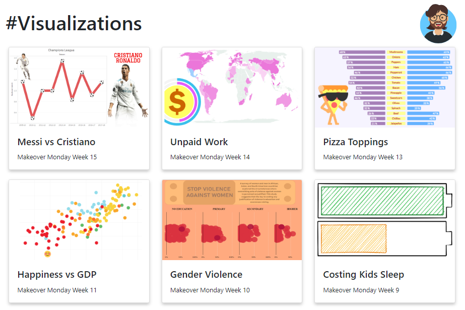

# infovis-itba
Information Visualization @ITBA

| Data Set        | Visualization           |
| :-------------: |:-------------:| 
| [The National Registry of individuals](https://datos.gob.ar/dataset/otros-nombres-personas-fisicas)| [Popular Names](https://observablehq.com/@obalfour/untitled/2) |
| [IG Web Data Connector](https://illonage.github.io/)| [Datagram](https://public.tableau.com/profile/oliver7403#!/vizhome/Datagram/Dashboard1) |
| [Makeover Monday Week 15](https://data.world/makeovermonday/2020w15-messi-vs-ronaldo-stats)| [Cristiano Ronaldo vs Lionel Messi](https://public.tableau.com/profile/oliver7403#!/vizhome/MakeoverMondayWeek15CristianoRonaldovsLionelMessi/STATS) |
| [Makeover Monday Week 14](https://data.world/makeovermonday/2020w14)| [Unpaid Work](https://obalfour.github.io/infovis-itba/Makeover%20Monday%20Week%2014/index.html) |
| [Makeover Monday Week 13](https://data.world/makeovermonday/2020w13-does-pineapple-belong-on-a-pizza)| [Does pineapple belong on a pizza?](https://my.visme.co/view/76pqmwzz-makeover-monday-week-13) |
| [Makeover Monday Week 11](https://data.world/makeovermonday/2020w11-self-reported-life-satisfaction-vs-gdp-per-capita)| [Happiness and Life Satisfaction](https://public.tableau.com/profile/oliver7403#!/vizhome/Week11visualization/Dashboard1?publish=yes) |
| [Makeover Monday Week 10](https://data.world/makeovermonday/2020w10)| [Violence Against Women & Girls](https://public.tableau.com/profile/oliver7403#!/vizhome/MakeoverMondayWeek10-ViolenceAgainstWomenandGirls_15839457836310/MM2020W10?publish=yes) |
| [Makeover Monday Week 9](https://data.world/makeovermonday/2020w9)| [Costing Kids Sleep](https://github.com/Obalfour/infovis-itba/blob/gh-pages/Makeover%20Monday%20Week%209/Week%209%20Visualization.png) |

All the visualizations are available in [my portfolio](https://obalfour.github.io/infovis-itba/index.html)

